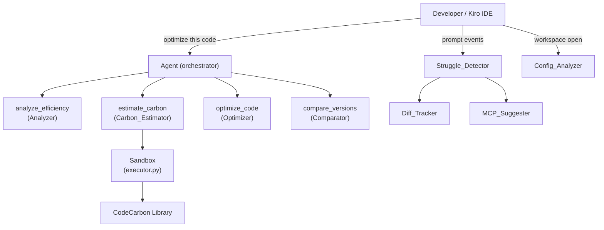
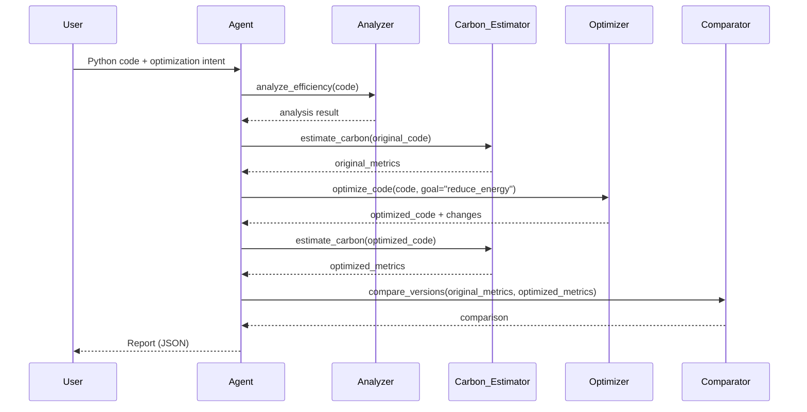

# Design Document: Carbon-Aware Code Optimizer

## Overview

The Carbon-Aware Code Optimizer is a Kiro-native agent that analyzes Python source code for inefficiencies, estimates its carbon footprint via sandboxed execution and CodeCarbon measurement, generates rule-based optimized versions, and produces a structured before-vs-after comparison report.

The system is composed of five core components — Analyzer, Carbon_Estimator, Sandbox, Optimizer, and Comparator — orchestrated by an Agent pipeline. Two passive subsystems run alongside: the Struggle_Detector (with Diff_Tracker and MCP_Suggester) and the Config_Analyzer.

### Design Goals

- **Safety first**: All user code runs in a process-isolated sandbox with strict resource limits.
- **Determinism**: Metrics are reproducible within ±10% variance on the same hardware.
- **Correctness**: Optimized code must always parse as valid Python (AST round-trip guarantee).
- **Explainability**: Every output is a documented JSON schema; every change has a human-readable description.
- **Passivity**: Struggle detection and config analysis are non-intrusive — they only surface warnings when signals are triggered.

---

## Architecture

The system follows a layered architecture with a clear separation between the orchestration layer (Agent), the tool layer (four tools), the execution layer (Sandbox), and the two passive subsystems.



### Pipeline Flow



---

## Components and Interfaces

### Agent (`tools/analyze.py`, `tools/measure.py`, `tools/optimize.py`)

The Agent is the orchestration entry point. It exposes the four tools as callable functions and sequences them in the fixed 5-step pipeline.

```python
def run_pipeline(code: str) -> Report:
    """Execute the full optimization pipeline and return a Report."""
```

**Error handling contract**: If any step returns `{"error": true, ...}`, the Agent immediately returns a pipeline-error Report without executing subsequent steps.

---

### Analyzer (`core/ast_analyzer.py`, `core/complexity.py`)

Parses Python source using the `ast` module and computes complexity metrics via `radon`.

```python
def analyze_efficiency(code: str) -> AnalysisResult | ErrorResponse:
    """Parse code, compute complexity, detect issues, return structured result."""
```

**Issue detection rules**:
- Nested loops (depth ≥ 2): walk AST for `For`/`While` nodes nested inside other `For`/`While` nodes; record line number.
- Repeated sub-expressions in loops: detect identical `ast.expr` subtrees appearing more than once inside a loop body.
- Issues are sorted by Complexity_Score descending.

---

### Carbon_Estimator (`core/carbon.py`, `core/profiler.py`)

Executes code in the Sandbox, measures wall-clock time and peak memory, then delegates to CodeCarbon for energy/CO₂ derivation.

```python
def estimate_carbon(code: str) -> Metrics | ErrorResponse:
    """Run code in sandbox, measure resources, return Metrics."""
```

**Measurement approach**:
- Wall-clock time: `time.perf_counter()` around sandbox execution call.
- Peak memory: `tracemalloc` or `resource.getrusage(RUSAGE_CHILDREN)`.
- Energy/CO₂: `codecarbon.EmissionsTracker` wrapping the sandbox execution.

---

### Sandbox (`sandbox/executor.py`)

Provides process-isolated execution using Python's `multiprocessing` with a custom import hook.

```python
def execute(code: str, timeout_s: float = 5.0, memory_limit_bytes: int = 256 * 1024 * 1024) -> ExecutionResult | ErrorResponse:
    """Execute code string in an isolated subprocess with resource constraints."""
```

**Isolation mechanisms**:
- Spawns a fresh subprocess (not fork) to avoid shared state.
- Custom `__import__` override enforces the module allowlist before any import resolves.
- `resource.setrlimit(RLIMIT_AS, ...)` enforces the memory cap inside the child process.
- Temporary working directory created via `tempfile.mkdtemp()`; cleaned up in a `finally` block.
- Network access restricted by blocking socket creation inside the child (override `socket.socket`).

**Module allowlist** (configurable, defaults):
```
builtins, math, itertools, functools, collections, typing,
operator, string, re, json, datetime, decimal, fractions,
random, statistics, heapq, bisect, array, struct
```

---

### Optimizer (`core/ast_analyzer.py` + transformation passes)

Applies rule-based AST transformations and validates the result via re-parse.

```python
def optimize_code(code: str, goal: str = "reduce_energy") -> OptimizationResult | ErrorResponse:
    """Apply transformations, validate AST round-trip, return optimized code."""
```

**Transformation passes** (applied in order):
1. `LoopReductionPass` — flatten or vectorize nested loops where safe.
2. `ExpressionHoistingPass` — hoist loop-invariant sub-expressions to pre-loop assignments.
3. `MemoizationPass` — wrap pure functions called repeatedly with `functools.lru_cache`.
4. `AlgorithmicSubstitutionPass` — replace O(n²) list membership tests with set lookups.

Each pass:
1. Transforms the AST.
2. Calls `ast.unparse()` to produce a code string.
3. Calls `ast.parse()` on the result; if this raises `SyntaxError`, the pass is discarded and the original AST is retained.

---

### Comparator (`core/comparator.py`)

Pure function — no I/O, no side effects.

```python
def compare_versions(original: Metrics, optimized: Metrics) -> Comparison | ErrorResponse:
    """Compute percentage improvements and generate summary string."""
```

Formula: `improvement = round(((original - optimized) / original) * 100, 2)`

---

### Struggle_Detector

In-memory, session-scoped component. Subscribes to prompt-submission events from the Kiro IDE event bus.

```python
class StruggleDetector:
    def on_prompt_submitted(self, prompt: str, file_refs: list[str]) -> None: ...
    def on_edit_generated(self, file_path: str, line_range: tuple[int, int]) -> None: ...
    def on_edit_reverted(self, file_path: str) -> None: ...
```

**Signal detection**:
- Repeated prompts: TF-IDF vectorization of prompt history + cosine similarity ≥ 0.80.
- High-frequency file requests: sliding 10-minute window counter per file ≥ 7.
- Oversized prompt: `ceil(len(prompt) / 4) > 1500`.
- Repeated content pasting: hash of pasted content blocks; flag if same hash appears in ≥ 2 prompts.
- Repeated region edits (Diff_Tracker): same file + overlapping line range across ≥ 3 generation events.
- Repeated rejections: revert-before-new-prompt counter per file ≥ 3 → escalate to high severity.

---

### Config_Analyzer

Scans workspace on open; re-scans on file-save events for tracked config files.

```python
def analyze_configs(workspace_root: str) -> list[Issue] | ErrorResponse:
    """Scan deployment config files and return sorted Issue list."""
```

**Parsers used**:
- `Dockerfile`: line-by-line regex + instruction parser (no external library needed).
- `.dockerignore`: plain text line reader.
- `vercel.json` / `netlify.toml`: `json.loads` / `tomllib.loads`.
- GitHub Actions workflows: `yaml.safe_load`.

Issues are sorted by `carbon_impact_score` (enum: HIGH > MEDIUM > LOW) descending.

---

## Data Models

### Metrics

```json
{
  "execution_time_ms": 42.5,
  "memory_used_bytes": 1048576,
  "energy_kwh": 0.000001234,
  "co2_grams": 0.000567
}
```

### Issue

```json
{
  "issue_id": "nested-loop-L12",
  "severity": "HIGH",
  "line_number": 12,
  "description": "Nested loop of depth 2 detected. Consider flattening or using vectorized operations.",
  "suggested_fix": "Replace inner loop with a list comprehension or numpy operation.",
  "carbon_impact_score": "HIGH"
}
```

### AnalysisResult

```json
{
  "functions": [
    {
      "name": "process_data",
      "complexity_score": 8,
      "line_start": 5,
      "line_end": 20
    }
  ],
  "issues": [ /* ordered list of Issue objects */ ],
  "parse_time_ms": 12.3
}
```

### OptimizationResult

```json
{
  "optimized_code": "def process_data(items):\n    seen = set()\n    ...",
  "changes": [
    {
      "pass": "AlgorithmicSubstitutionPass",
      "description": "Replaced O(n²) list membership test with O(1) set lookup on line 14.",
      "line_number": 14
    }
  ],
  "expected_improvement_percent": 35.0
}
```

### Comparison

```json
{
  "execution_time_improvement_pct": 42.10,
  "memory_improvement_pct": 15.30,
  "co2_improvement_pct": 38.75,
  "summary": "Optimization reduced CO₂ emissions by 0.000220 grams (38.75%) and execution time by 42.10%."
}
```

### Report (full pipeline output)

```json
{
  "analysis": { /* AnalysisResult */ },
  "original_metrics": { /* Metrics */ },
  "optimized_code": "...",
  "optimized_metrics": { /* Metrics */ },
  "comparison": { /* Comparison */ }
}
```

### ErrorResponse (all tools)

```json
{
  "error": true,
  "tool": "estimate_carbon",
  "message": "Execution timed out after 5 seconds.",
  "error_type": "TimeoutError"
}
```

### StruggleSignal

```json
{
  "signal_type": "repeated_prompt_loop",
  "severity": "medium",
  "message": "You may be in an AI retry loop. Consider adding structured context or using a relevant MCP server.",
  "mcp_suggestion": {
    "server": "Context7 MCP",
    "reason": "API or library confusion detected"
  }
}
```

### ConfigIssue

```json
{
  "issue_id": "unpinned-base-image",
  "file_path": "Dockerfile",
  "line_number": 1,
  "description": "Base image uses the 'latest' tag, which is a mutable reference.",
  "carbon_impact_score": "HIGH",
  "remediation": "Pin to a specific version using a minimal base image.",
  "example_fix": "FROM python:3.12-slim"
}
```

---

## Correctness Properties


*A property is a characteristic or behavior that should hold true across all valid executions of a system — essentially, a formal statement about what the system should do. Properties serve as the bridge between human-readable specifications and machine-verifiable correctness guarantees.*

### Property 1: Complexity score completeness

*For any* valid Python code string containing N named functions, calling `analyze_efficiency` SHALL return an `AnalysisResult` whose `functions` list contains exactly N entries, each with a non-null `complexity_score`.

**Validates: Requirements 1.2**

---

### Property 2: Nested-loop issue detection

*For any* valid Python code string, `analyze_efficiency` SHALL include a nested-loop `Issue` in the result if and only if the code contains a `For` or `While` node nested inside another `For` or `While` node at depth ≥ 2.

**Validates: Requirements 1.3**

---

### Property 3: Issues list is sorted by severity

*For any* `AnalysisResult` with two or more issues, the `issues` list SHALL be sorted in descending order of `complexity_score` (i.e., `issues[i].complexity_score >= issues[i+1].complexity_score` for all i).

**Validates: Requirements 1.6**

---

### Property 4: Invalid input yields error with no partial results

*For any* code string that is empty or contains a Python syntax error, `analyze_efficiency` SHALL return an `ErrorResponse` (with `"error": true`) and SHALL NOT include any `functions` or `issues` fields in the response.

**Validates: Requirements 1.5**

---

### Property 5: Metrics schema completeness

*For any* valid Python code string that executes without error, `estimate_carbon` SHALL return a `Metrics` object containing all four required fields — `execution_time_ms`, `memory_used_bytes`, `energy_kwh`, and `co2_grams` — each with a non-negative numeric value.

**Validates: Requirements 2.2, 2.3, 2.4**

---

### Property 6: Exception in sandbox yields error with no partial Metrics

*For any* Python code string that raises an unhandled exception during execution, `estimate_carbon` SHALL return an `ErrorResponse` containing the exception type and message, and SHALL NOT include any Metrics fields.

**Validates: Requirements 2.5**

---

### Property 7: Metrics determinism across repeated runs

*For any* valid Python code string, running `estimate_carbon` three consecutive times under idle system conditions SHALL produce `execution_time_ms` values where `max(times) / min(times) <= 1.10`.

**Validates: Requirements 2.7**

---

### Property 8: Sandbox blocks non-allowlisted imports

*For any* Python code string that attempts to import a module not in the approved allowlist, the Sandbox SHALL raise an `ImportError` and terminate execution before the import resolves.

**Validates: Requirements 3.4**

---

### Property 9: Sandbox filesystem isolation

*For any* Python code string that attempts to read or write files outside the designated temporary directory, the Sandbox SHALL deny the access and return an error response.

**Validates: Requirements 3.1**

---

### Property 10: Sandbox resource cleanup

*For any* code execution (whether it succeeds, raises an exception, or times out), the Sandbox SHALL ensure the temporary working directory no longer exists after the call returns.

**Validates: Requirements 3.3**

---

### Property 11: Optimizer output schema completeness

*For any* valid Python code string passed to `optimize_code` with goal `"reduce_energy"`, the result SHALL always contain `optimized_code` (a non-empty string), `changes` (a list), and `expected_improvement_percent` (a numeric value).

**Validates: Requirements 4.1**

---

### Property 12: Every applied change has a human-readable description

*For any* `OptimizationResult` where `changes` is non-empty, every entry in `changes` SHALL contain a non-empty `description` string.

**Validates: Requirements 4.7**

---

### Property 13: Optimizer preserves behavioral equivalence

*For any* valid Python function and any valid input to that function, executing the original code and the optimized code in the Sandbox SHALL produce identical return values and side effects.

**Validates: Requirements 4.5**

---

### Property 14: AST round-trip — optimized code is always valid Python

*For any* valid Python code string, calling `optimize_code` and then calling `ast.parse()` on the returned `optimized_code` string SHALL succeed without raising a `SyntaxError`.

**Validates: Requirements 7.2**

---

### Property 15: Comparison formula correctness

*For any* pair of `Metrics` objects (original, optimized) where all required fields are present and original values are non-zero, `compare_versions` SHALL compute each improvement percentage as `round(((original_val - optimized_val) / original_val) * 100, 2)`, including negative values when `optimized_val > original_val`.

**Validates: Requirements 5.2, 5.3**

---

### Property 16: Comparison summary is non-empty and contains CO₂ values

*For any* valid pair of `Metrics` objects, the `Comparison` returned by `compare_versions` SHALL include a non-empty `summary` string that contains the CO₂ reduction in grams and the CO₂ improvement percentage.

**Validates: Requirements 5.4**

---

### Property 17: Missing Metrics field yields error identifying the field

*For any* `Metrics` object with one or more required fields omitted, `compare_versions` SHALL return an `ErrorResponse` whose `message` field names the missing field.

**Validates: Requirements 5.5**

---

### Property 18: Pipeline executes tools in fixed order

*For any* valid Python code input, the Agent SHALL invoke the five tools in the order: `analyze_efficiency` → `estimate_carbon(original)` → `optimize_code` → `estimate_carbon(optimized)` → `compare_versions`, with no steps skipped or reordered.

**Validates: Requirements 6.1**

---

### Property 19: Pipeline code immutability

*For any* Python code string submitted to the Agent, the code string passed to `optimize_code` SHALL be byte-for-byte identical to the code string passed to the first `estimate_carbon` call.

**Validates: Requirements 6.4**

---

### Property 20: Pipeline error halts at failing step

*For any* pipeline run where tool at position N returns an `ErrorResponse`, the Agent SHALL not invoke any tool at position > N, and SHALL return an `ErrorResponse` identifying the failed tool name.

**Validates: Requirements 6.3**

---

### Property 21: All tool outputs conform to their JSON schemas

*For any* valid input to any of the five tools (`analyze_efficiency`, `estimate_carbon`, `optimize_code`, `compare_versions`, and the Agent pipeline), the output SHALL be a valid JSON object that conforms to the documented schema for that tool, including all required fields with correct types.

**Validates: Requirements 8.1, 8.2, 8.3, 8.4, 8.5**

---

### Property 22: Error responses always contain required error fields

*For any* error condition in any tool, the returned `ErrorResponse` SHALL contain `"error": true`, a non-empty `"tool"` string, and a non-empty `"message"` string.

**Validates: Requirements 8.6**

---

### Property 23: Prompt history accumulates all submitted prompts

*For any* sequence of N prompts submitted within a session, the `StruggleDetector`'s history buffer SHALL contain all N prompts after the sequence completes.

**Validates: Requirements 9.1**

---

### Property 24: Cosine similarity threshold triggers repeated-prompt signal

*For any* pair of prompts whose TF-IDF cosine similarity exceeds 0.80, the `StruggleDetector` SHALL raise a repeated-prompt-loop signal; for any pair with similarity ≤ 0.80, no signal SHALL be raised.

**Validates: Requirements 9.2, 9.3**

---

### Property 25: Token estimate formula correctness

*For any* prompt string of length L, the `StruggleDetector` SHALL compute the token estimate as `ceil(L / 4)` and flag an oversized-prompt signal if and only if this value exceeds 1,500.

**Validates: Requirements 9.6, 9.7**

---

### Property 26: High-frequency file reference threshold

*For any* file path, the `StruggleDetector` SHALL flag a high-frequency-retry-loop signal if and only if the count of AI requests referencing that file within any rolling 10-minute window reaches 7 or more.

**Validates: Requirements 9.4, 9.5**

---

### Property 27: Repeated-region edit threshold

*For any* file path and line range, the `Diff_Tracker` SHALL flag a repeated-region-edit signal if and only if AI-generated edits overlap that region across 3 or more distinct generation events.

**Validates: Requirements 9.9, 9.10**

---

### Property 28: Rejection counter escalation

*For any* file path, the `StruggleDetector` SHALL escalate struggle severity to high if and only if the rejection counter for that file reaches 3 or more.

**Validates: Requirements 9.11, 9.12**

---

### Property 29: MCP suggestion mapping correctness

*For any* raised struggle signal, the `MCP_Suggester` SHALL return the contextually correct MCP server recommendation according to the defined struggle-type-to-server mapping (e.g., API confusion → Context7 MCP, AWS issue → AWS Docs MCP).

**Validates: Requirements 9.13**

---

### Property 30: Config issue detection for all Dockerfile patterns

*For any* `Dockerfile` content, the `Config_Analyzer` SHALL flag the correct `Issue` for each of the following patterns if and only if the pattern is present: unpinned base image tag, missing `.dockerignore`, `COPY . .` before dependency install, absent multi-stage build, and `npm install`/`npm ci` without `--omit=dev`.

**Validates: Requirements 10.2, 10.3, 10.4, 10.5, 10.6**

---

### Property 31: Config issues list is sorted by carbon impact

*For any* workspace that produces two or more config `Issue` objects, the returned list SHALL be sorted in descending order of `carbon_impact_score` (HIGH > MEDIUM > LOW).

**Validates: Requirements 10.9**

---

### Property 32: Config parse error does not halt remaining file scans

*For any* workspace containing one syntactically invalid config file among valid ones, the `Config_Analyzer` SHALL return a structured error for the invalid file AND continue scanning and returning results for all remaining config files.

**Validates: Requirements 10.11**

---

### Property 33: Every config issue includes remediation and example fix

*For any* `ConfigIssue` returned by the `Config_Analyzer`, the `remediation` and `example_fix` fields SHALL both be non-empty strings.

**Validates: Requirements 10.12**

---

## Error Handling

### Error Response Contract

Every component returns either a valid result object or an `ErrorResponse`. There are no exceptions propagated across component boundaries — all errors are caught and converted to structured responses.

```python
@dataclass
class ErrorResponse:
    error: bool = True
    tool: str = ""
    message: str = ""
    error_type: str = ""  # e.g., "TimeoutError", "SyntaxError", "MemoryExceededError"
```

### Error Categories

| Category | Trigger | Response |
|---|---|---|
| `SyntaxError` | Invalid Python code passed to Analyzer or Optimizer | `ErrorResponse` with descriptive message, no partial results |
| `TimeoutError` | Sandbox execution exceeds 5 seconds | `ErrorResponse`, sandbox subprocess terminated |
| `MemoryExceededError` | Sandbox execution exceeds memory limit | `ErrorResponse`, sandbox subprocess terminated |
| `ImportError` | Non-allowlisted module import attempted | `ErrorResponse`, execution terminated immediately |
| `ExecutionError` | Unhandled exception in sandboxed code | `ErrorResponse` with exception type and message |
| `ValidationError` | Missing required field in Metrics/input | `ErrorResponse` identifying the missing field |
| `ParseError` | Config file cannot be parsed | `ErrorResponse` with file path and parse error; scanning continues |
| `PipelineError` | Any tool in the Agent pipeline returns an error | `ErrorResponse` identifying the failed tool; pipeline halts |

### Sandbox Error Isolation

The Sandbox subprocess communicates results back to the parent process via a `multiprocessing.Queue`. If the subprocess is killed (timeout, memory exceeded, or OS signal), the parent detects the absence of a result on the queue and constructs the appropriate `ErrorResponse`. This ensures the parent process is never affected by child process failures.

### Optimizer Fallback

Each transformation pass wraps its AST manipulation in a try/except. If `ast.unparse()` or the subsequent `ast.parse()` raises any exception, the pass is silently discarded and the pre-pass AST is retained. This guarantees the optimizer never returns invalid Python.

---

## Testing Strategy

### Dual Testing Approach

The testing strategy combines **property-based tests** (for universal correctness properties) and **unit/integration tests** (for specific examples, edge cases, and infrastructure wiring).

### Property-Based Testing

**Library**: [`hypothesis`](https://hypothesis.readthedocs.io/) (Python)

**Configuration**: Each property test runs a minimum of 100 iterations (`@settings(max_examples=100)`).

**Tag format**: Each property test is tagged with a comment:
```python
# Feature: carbon-aware-code-optimizer, Property N: <property_text>
```

**Generators needed**:
- `valid_python_code()` — generates syntactically valid Python functions with varying complexity
- `invalid_python_code()` — generates empty strings and syntactically broken Python
- `python_code_with_nested_loops(depth)` — generates code with controllable loop nesting depth
- `python_code_with_repeated_subexpressions()` — generates loop bodies with repeated sub-expressions
- `metrics_pair()` — generates pairs of `Metrics` objects with random numeric values
- `metrics_with_missing_field()` — generates `Metrics` objects with one required field omitted
- `prompt_pair_with_similarity(above_threshold: bool)` — generates prompt pairs with known similarity
- `dockerfile_content(patterns: list[str])` — generates Dockerfile strings with controllable patterns
- `workspace_with_configs(file_set: set[str])` — generates workspace directory structures

**Properties to implement** (one test per property, numbered to match design):
- Properties 1–4: Analyzer correctness
- Properties 5–7: Carbon_Estimator correctness
- Properties 8–10: Sandbox isolation and cleanup
- Properties 11–14: Optimizer correctness and AST round-trip
- Properties 15–17: Comparator correctness
- Properties 18–20: Agent pipeline ordering and error propagation
- Properties 21–22: Schema conformance across all tools
- Properties 23–29: Struggle_Detector signal thresholds and MCP mapping
- Properties 30–33: Config_Analyzer detection and ordering

### Unit and Integration Tests

**Framework**: `pytest`

**Unit tests** cover:
- Specific examples for each tool (happy path with known inputs/outputs)
- Edge cases: empty code, zero-metric comparison, single-function code
- Error conditions: timeout (sleep(10) code), memory exceeded (large list allocation), non-allowlisted import
- Optimizer no-op case (code with no detectable patterns)
- Struggle_Detector silence when no signals are triggered
- Config_Analyzer on empty workspace

**Integration tests** cover:
- Full pipeline execution with a real Python code sample
- Sandbox process isolation (filesystem and network access attempts)
- CodeCarbon integration (verify `energy_kwh` and `co2_grams` are non-zero for non-trivial code)
- Config_Analyzer on a real workspace with all supported config file types

### Test File Structure

```
tests/
├── unit/
│   ├── test_analyzer.py
│   ├── test_carbon_estimator.py
│   ├── test_sandbox.py
│   ├── test_optimizer.py
│   ├── test_comparator.py
│   ├── test_agent.py
│   ├── test_struggle_detector.py
│   ├── test_diff_tracker.py
│   ├── test_mcp_suggester.py
│   └── test_config_analyzer.py
├── property/
│   ├── test_analyzer_properties.py       # Properties 1–4
│   ├── test_estimator_properties.py      # Properties 5–7
│   ├── test_sandbox_properties.py        # Properties 8–10
│   ├── test_optimizer_properties.py      # Properties 11–14
│   ├── test_comparator_properties.py     # Properties 15–17
│   ├── test_agent_properties.py          # Properties 18–20
│   ├── test_schema_properties.py         # Properties 21–22
│   ├── test_struggle_properties.py       # Properties 23–29
│   └── test_config_properties.py         # Properties 30–33
└── integration/
    ├── test_pipeline_integration.py
    ├── test_sandbox_isolation.py
    └── test_config_analyzer_integration.py
```
